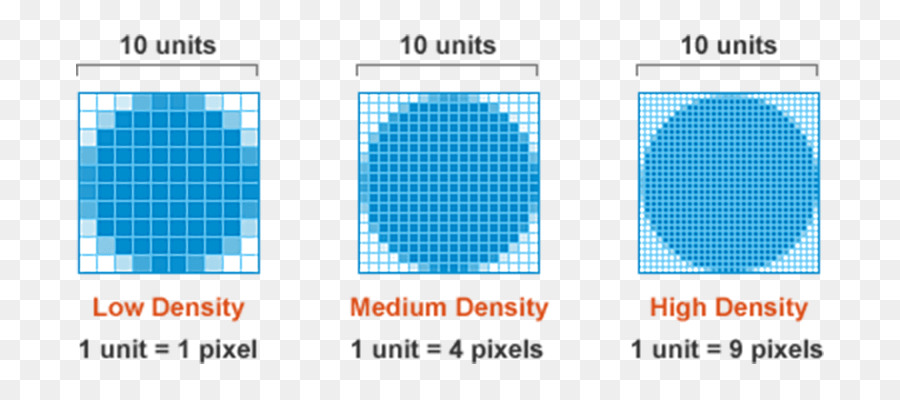
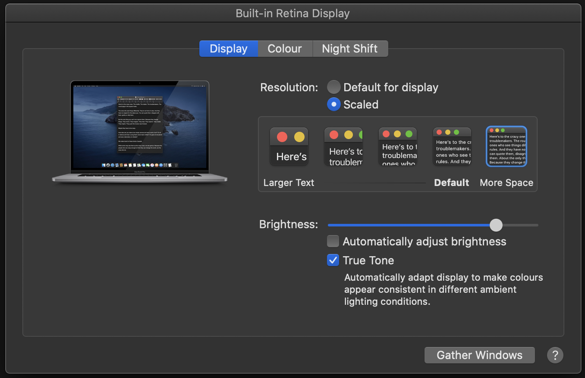
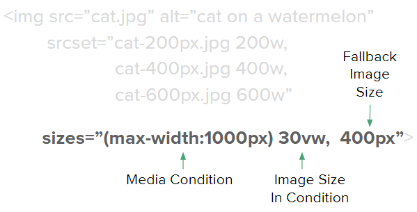
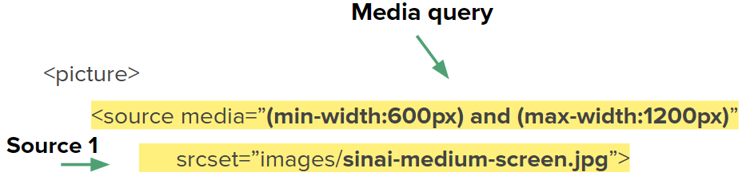
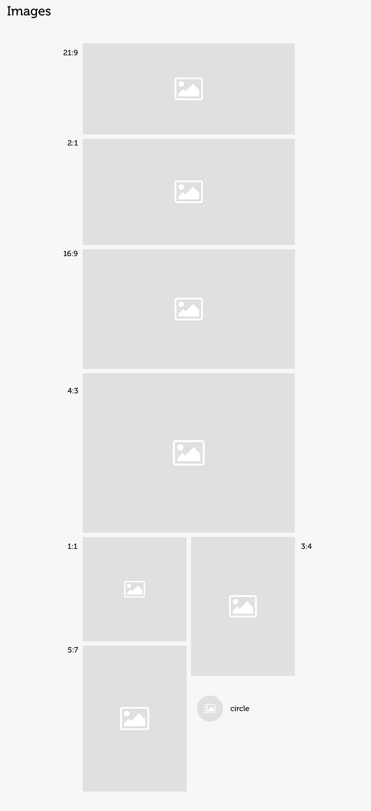
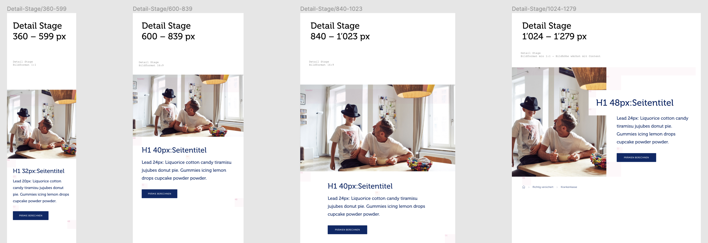
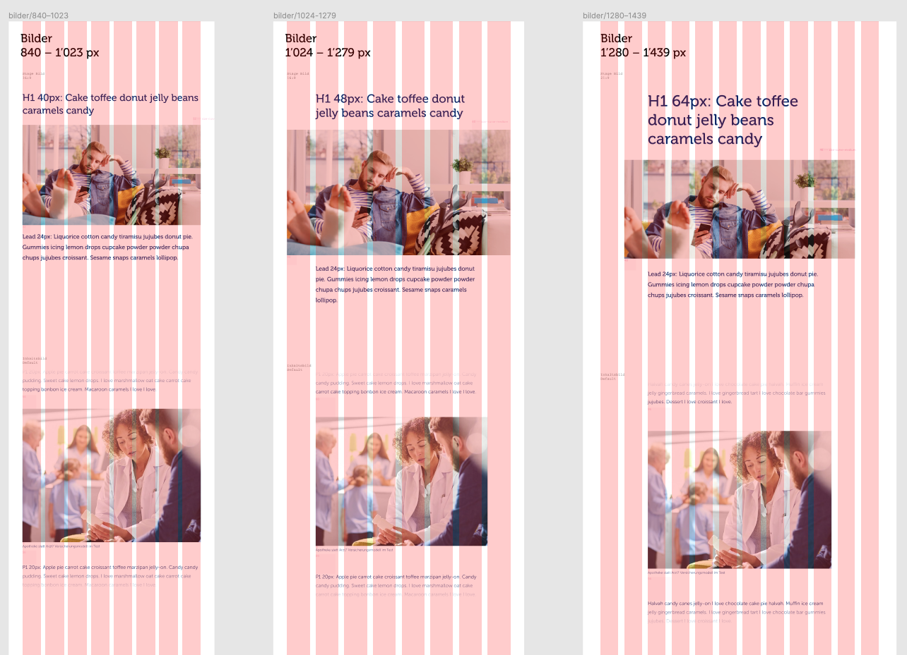
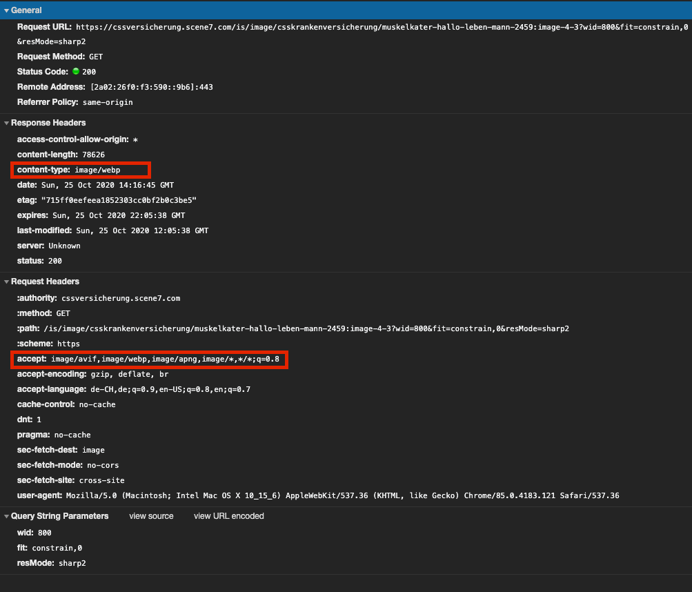

# Responsive Images: Die Implementation von post.ch & css.ch

## Inhalt

* [Intro](#intro)
* [Responsive Images](#responsive-images)
* [Implementation/Umsetzung](#implementationumsetzung)

## Intro

In diesem Abschnitt schauen wir die Implementation von Responsive Images an, welche auf [post.ch](https://post.ch) und [css.ch](https://css.ch) verwendet wird. Bei den Beispielen werden jeweils Codeausschnitte der beiden Projekten verwendet.

## Responsive Images

### Recap: Hochauflösende Displays

Generell geht man davon aus, dass auf kleineren Devices auch kleinere Bilder geladen werden sollten, dies ist aber nicht immer der Fall.

> “A Pixel is Not a Pixel”

Es gibt einen Unterschied von **CSS Pixel** zu **Screen Pixel**. CSS Pixel sind für Abmessungen auf unserer Website, und die Screen Pixel sind die physischen Pixel, welche vom device genutzt werden.



**Device Pixel Ratio (DPR) Beispiele**

| Device | Native Pixel | CSS Pixel | Device Pixel Ratio (DPR) |
|---|--:|--:|:-:|
| iPhone 6, 6s, 7, 8, SE (2020) | 750 x 1334 | 375 x 667 | 2 |
| iPhone 11 Pro, X, XS | 1125 x 2436 | 375 x 812 | 3 |
| iPad Air 2020 | 2360 x 1640 | 1180 x 820 | 2 |

**Scharfe Bilder liefern**

Was bedeutet dies? Wie gross müssen unsere Bilder sein, damit das Bild auf diesen Devices nicht verschwommen ist?

| CSS Pixel | DPR 1.0 | DPR 2.0 (4x px) | DPR 3.0 (9x px) | DPR 4.0 (16x px) |
|--:|--:|--:|--:|--:|
| 40px | 40px | 80px | 120px | 160px |
| 150px | 150px | 300px | 450px | 600px |
| 400px | 400px | 800px | 1200px | 1600px |

Bei dieser Tabelle sehen wir, dass bei einem Pixel Ratio von **3x** oder **4x** **die Grösse des Bildes rapide zunimmt**, damit das Bild "scharf" dargestellt werden kann. Dies ist nicht immer optimal, da auf mobilen Geräten meist schwächere Hardware verbaut ist, als auf Desktop-Geräten. Zudem hat man eventuell sogar noch eine schlechtere Internetverbindung, was das Problem noch verstärkt.

**Speziellere DPR**

Bis jetzt war es immer so, dass ein Device ein genaues DPR hatte (2.0, 3.0, etc.). Gibt es auch ein DPR von z.B. 1.5? Die Antwort ist ziemlich einfach: **Ja**, das gibt es.  



Als Beispiel kann ein MacBook Pro 16" so eingestellt werden, dass der Laptop kein DPR von 2.0 hat, sondern von **1.5**.  
Diese würde also bedeuten, dass, um auf dem Laptop ein Bild in 40px darzustellen, das "perfekte" Bild also 60px breit sein müsste, und nicht 80px wie bei einer DPR von 2.0.

### Schwierigkeiten erklärt

Bei Responsive images müssen wir generell auf folgende Schwierigkeiten achten:

- Kleinere Devices sollten generell kleinere Bilder erhalten
- Das Device Pixel Ratio sollte so genutzt werden, dass Bilder möglichst scharf sind, aber die Payload des Bildes nicht explodiert.
- Je nach Modul/Use-Case kann es sein, dass das Bildformat von device zu device ändert
- Verschiedene Browser unterstützen verschiedene Dateiformate, wie können wir das handeln/nutzen?

### Die Display Density Descriptor Methode

Der Density Descriptor kann innerhalb eines `srcset` genutzt werden. Er gibt dem Browser gewisse Metainformationen, damit dieser entscheiden kann, welches Bild er wirklich runterladen will.  
Im unteren Beispiel würde auf einem iPhone 6 z.B. das Bild `puppy-400px.jpg` geladen werden. Auf einem iPhone X würde das Bild `puppy-600px.jpg` geladen werden.

*Wichtig dabei ist, dass der Descriptor dem Browser nur sagt, welches Bild für welche DPR gedacht ist. Der Descriptor gibt dem Browser keinerlei Informationen wie breit das Bild ist.*

**Example**

```html

```

**Pros**

Dieser descriptor ermöglicht es uns, einem Browser ein Bild aufzuzwingen. Somit werden Bilder scharf angezeigt, egal auf welchem Device wir uns befinden.

**Cons**

Für ein Device, welches eine DPR von z.B. 1.5 hat, wird jeweils das nächst grössere Bild runtergeladen. Dies würde bedeuten, dass auf unserem MacBook 16" mit einer DPR von 1.5 ein zu grossesn Bild geladen werden muss, damit es scharf angezeigt werden kann.

**Demo** 🤯

- [Display Density Descriptor](https://codesandbox.io/s/yb5t4)

**Hilfreiche Links**

* [Use density descriptors](https://web.dev/codelab-density-descriptors/)

### Die Width Descriptor Methode mit dem `sizes`-Attribut

Hier nutzen wir eine Kombination des Width Descriptors und des `sizes`-Attributes.  
Der Width Descriptor gibt uns die Möglichkeit, dem Browser die Metainformation zu geben, wie breit das Bild ist.  
Diese Methode ist vor allem dann sinnvoll, wenn die Breite eines Bildes sich ändert, je nach der Grösse des Viewports. **Dies ist der meist genutzte Case bei Responsive Images**.

**Example**

```html

```

Leider nützt diese Information alleine dem Browser nicht all zu viel, da der Browser noch nicht weiss, wie breit das Bild angezeigt wird. Da die Anzeige des Bildes sich ändert, je nachdem wie breit unser Viewport ist, kann auch kein `width`-Attribut verwendet werden.

#### `sizes`-Attribut

Der `sizes`-Attribut ermöglicht uns, dem Browser mitzuteilen, wie breit ein Bild effektiv dargestellt wird. Es kann entweder ein Wert mitgegeben werden, oder mehrere separiert mit einem **,** (Komma). In dem Attribut können ebenfalls Media-Queries verwendet werden. Wenn mehrere Werte mitgegeben werden, werden diese von *left to right* evaluiert, sobald ein Media-Query zutrifft, wird die respektable size als Anzeigebreite des Bildes genutzt.



**Image Size Condition**

Bei der Breitenangabe gibt es drei verschiedene Arten, wie man diese angeben kann.
- In `vw`
- In `px`
- In einer Kombination von beiden, verpackt in einem `calc()`

**Example**

```html
sizes="(max-width: 399px) 50vw,
       (min-width: 400px) and (max-width: 900px) calc(30vw - 40px), 
       100vw"
```

Im folgenden Beispielt sieht man ein Bild, welches immer einer relative Breite zum Viewport hat, aber ab einer gewissen Grösse des Viewports ist die Breite des Bildes fix und wird nicht mehr grösser.

```html

```

Mit den Informationen über die **verfügbaren Bilder** und der **Breite** in welcher das Bild angezeigt wird, kann der Browser nun selbst entscheiden, welches Bild er runterlädt, damit das Bild möglichst scharf ist. Dazu nutzt er ebenfalls die Information, was das **DPR** des Device ist und z.B. auch den connection speed.

**Avatar Example**

```html

```

| Viewport Breite | DPR | Anzeigebreite | Bild |
|---|--:|--:|:--|
| `300px` | 2 | `40px` | `avatar-80px.jpg` |
| `600px` | 3 | `40px` | `avatar-120px.jpg` |
| `1400px` | 1 | `60px` | `avatar-60px.jpg` |
| `1400px` | 1.5 | `60px` | `avatar-100px.jpg` |
| `1400px` | 2 | `60px` | `avatar-120px.jpg` |

**Demo** 🤯

- [Width Descriptor](https://codesandbox.io/s/0erxg)

### Das `<picture>`-Element

Das `<picture>`-Element ist ein neueres HTML5-Element, welches uns noch mehr Möglichkeiten für die Art Direction gibt. So kann z.B. auf Mobile ein Bild im Seitenverhältnis von 1:1 angezeigt werden, aber auf dem Desktop kann das Bild dann in 16:9 dargestellt werden. Es ermöglicht uns ebenfalls, dass wir mehrere Dateitypen unterstützen, damit neuere Browser von den neueren Dateitypen Gebrauch machen können, aber ältere Browser noch einen Fallback haben.

### Art Direction mit dem `<picture>`-Element
Mit dem `<source>`-Element können wir innerhalb des `<picture>`-Elements mehrere verschiedene Bilder angeben, welche wiederum auf verschiedenen Devices zum Zuge kommen können. Es können soviele `<source>`-Elemente genutzt werden wie einem beliebt.



Wenn mehrere `<source>`-Elemente angegeben werden, evaluiert der Browser diese von *first to last*. Sobald der Browser eine `<source>` hat, die alle Kriterien erfüllt, wird das angegebene Bild verwendet.

**Example**

```html
<picture>
   <source media="(min-width:600px) and (max-width:1200px)"
           srcset="cat-medium.jpg">
   <source media="(min-width:1201px)"
           srcset="cat-large.jpg">
   
</picture>
```

### Verschiedene Dateiformate unterstützen

Eine `<source>` ermöglicht uns ebenfalls, dass wir das gleiche Bild in verschiedenen Dateiformaten angeben können.  
Falls ein Browser den angegebenen `type` nicht unterstützt, wird die ganze Source ignoriert.

**Example**

```html
<picture>
  <source srcset="cat-avif.avif" type="image/avif">
  <source srcset="cat-webp.webp" type="image/webp">
  <source srcset="cat-jpg.jpg" type="image/jpeg">
  
</picture>
```

**Hilfreiche Links**

* [AVIF has landed](https://jakearchibald.com/2020/avif-has-landed/)
* [Using WebP Images](https://css-tricks.com/using-webp-images/)

### Practice 🔥

Öffne diese [**CodeSandbox**](https://codesandbox.io/s/xc76o) als Startpunkt.

Die Übung hat bereits das Grid-System von Bootstrap integriert.

- [ ] Füge ein Responsive Image ein, nehme dafür die Bilddateien unter `./images/`
  - [ ] Das Bild sollte auf xs 12 Spalten breit sein, auf rg 6 Spalten, und ab lg 4 Spalten
  - [ ] Berechnet die sizes richtig, sodass die size auf jedem Breakpoint richtig angegeben wird.  
  Schaut euch dazu auch das CSS an, um zu schauen wieviel padding der Container, wieviel die Row und wieviel die Col hat. Bedenkt diese Werte beim berechnen der Size.

Zeit: ~ 15 min

## Implementation/Umsetzung

Wir schauen uns heute die Spezifische Implementation von [css.ch](https://css.ch) an.

### Modularität

Bei unserer Implementierung wollen wir eine generische Komponente erstellen, sodass wir Redundanzen vermeiden können und die Qualität des HTML in Bezug auf Bilder möglist immer gewährleistet werden kann.  
Die Komponente sollte sich wie ein **Atom** verhalten und sollte in allen anderen Modulen/Komponenten verwendet werden können.

### Art Direction

Zum einen haben wir viele verschiedene Seitenverhältnisse, welche in den div. Modulen vorkommen können.  



*Screenshot aus dem Design*

Und zum anderen gibt es Module, welche auf Breakpoint x ein anderes Seitenverhältnis haben wie auf Breakpoint y.



*Screenshot aus dem Design*

### `srcset` & `sizes`

#### Arbeiten mit einem Grid

Wenn man ein Grid nutzt, werden Bilder oftmals in x Spalten dargestellt.  
Im Beispiel hier ist das 2. Modul auf Tablet 8/8 Spalten breit, auf kleineren Desktops 6/8 Spalten und dann auf grösseren Desktops schliesslich 8/12 Spalten breit.



Damit die `sizes` richtig errechnet werden können, müssen wir auf div. Parameter Rücksicht nehmen.
- Die Breite des Containers
- Die Maximalbreite des Containers
- Die Spaltenanzahl auf den jeweiligen Breakpoints
- Der Gutter zwischen den Spalten

Wenn man diese Parameter alle in Betracht zieht, könnte eine Size so aussehen:

**Struktur**

```html
sizes="(min-width: {breakpoint-width}) calc(({base} - 2 * {container-padding} + {gutter}) * ({spalten}/{max-spalten}) - {gutter})"
```

**Example**

```html
sizes="(min-width: 1441px) calc((1440px - 2 * 128px + 16px) * (3/12) - 16px)"
```

**Demo** 🤯

- [Proof of Concept](https://codepen.io/christiansany/pen/jQGjwd)

*Der PoC wurde für post.ch erstellt, die sizes stimmen nicht 100% überein mit denen von css.ch, aber es reicht um das Prinzip zu illustrieren*

#### Berechnen der `sizes`

**Innerhalb des Grid ist eine Berechnung der sizes nicht immer einfach.** Dafür haben wir deshalb einen **Helper** erstellt, womit wir einfach die Spaltenbreite des Bildes angeben können, und der helper gibt uns dann die richtigen `sizes` zurück.  

```ts
// 🌈 Neues Code-Beispiel da das alte obsolete war
export type BreakpointName = "large" | "medium" | "small";

export type Breakpoint = {
  readonly name: BreakpointName;
  readonly width: string;
  readonly containerPadding: string;
  readonly gutter: string;
};

const breakpoints: Breakpoint[] = [
  {
    name: "large",
    width: "1000px",
    containerPadding: "64px",
    gutter: "16px",
  },
  {
    name: "medium",
    width: "440px",
    containerPadding: "32px",
    gutter: "16px",
  },
  {
    name: "small",
    width: "0px",
    containerPadding: "16px",
    gutter: "16px",
  },
];

export const getBreakpointByName = (name: BreakpointName): Breakpoint => {
  const breakpoint = breakpoints.find((breakpoint) => breakpoint.name === name);
  if (!breakpoint) {
    throw new Error("Given BreakpointName was not found");
  }
  return breakpoint;
};

const widthCalc = (
  width: string,
  containerPadding: string,
  gutter: string,
  columns: number,
  fixGutter?: number
) => {
  let calc = `calc((${width} - 2 * ${containerPadding} + ${gutter}) * (${columns}/12) - ${gutter})`;

  if (fixGutter) {
    calc = `calc(((${width} - 2 * ${containerPadding} + ${gutter}) * (${columns}/12) - ${gutter}) - ${
      fixGutter * 2
    }px)`;
  }

  return calc;
};

export const mapImageSizesToColumns = (
  configs: { name: BreakpointName; columns: number }[]
): string => {
  return configs
    .map((config, index) => {
      const breakpoint = getBreakpointByName(config.name);
      if (breakpoint) {
        if (breakpoint.name === "large") {
          // "large" is the largest breakpoint and should not use 100vw as calc base
          return `(min-width: ${breakpoint.width}) ${widthCalc(
            "1000px",
            breakpoint.containerPadding,
            breakpoint.gutter,
            config.columns,
            undefined
          )}`;
        } else if (
          breakpoint.name === "small" ||
          configs.length === index + 1
        ) {
          // "small" is the smallest breakpoint and should not have a media query
          return widthCalc(
            "100vw",
            breakpoint.containerPadding,
            breakpoint.gutter,
            config.columns,
            undefined
          );
        }
        // Default has media-query and 100vw as base width
        return `(min-width: ${breakpoint.width}) ${widthCalc(
          "100vw",
          breakpoint.containerPadding,
          breakpoint.gutter,
          config.columns,
          undefined
        )}`;
      }
    })
    .join(",");
};
```

**Example**
  
```ts
const sizes = mapImageSizesToColumns([
  { name: "large", columns: 4 },
  { name: "medium", columns: 6 },
  { name: "small", columns: 12 },
]);

// sizes
// (min-width: 1000px) calc((1000px - 2 * 64px + 16px) * (4/12) - 16px),
// (min-width: 440px) calc((100vw - 2 * 32px + 16px) * (6/12) - 16px),
// calc((100vw - 2 * 16px + 16px) * (12/12) - 16px)
```

**Demo** 🤯

- [🌟 React Demo]( https://codesandbox.io/p/sandbox/n8mczn?file=%2Fsrc%2FApp.tsx)
- [Playground Demo](https://codesandbox.io/s/o04l7)
- [Live Demo post.ch](https://www.post.ch)
- [Live Demo css.ch](https://www.css.ch)

### Types

Wir haben uns das Leben ein bisschen einfacher gemacht, und überlassen das richtige Auswählen des Types dem Backend, bzw. dem CDN, welcher bei [css.ch](https://css.ch) im Einsatz ist. Wenn beispielsweise ein .jpg angefordert wird, kann der CDN selbständig anhand des `accept`-Headers erkennen, ob `webp`, `avif` oder andere Dateiformate zugelassen wären. Falls dies der Fall ist, liefert er einfach diese in seiner Response.

Somit müssen wir die verschiedenen Dateitypen im Frontend nicht beachten, und für diese auch keine `<source>` schreiben.


